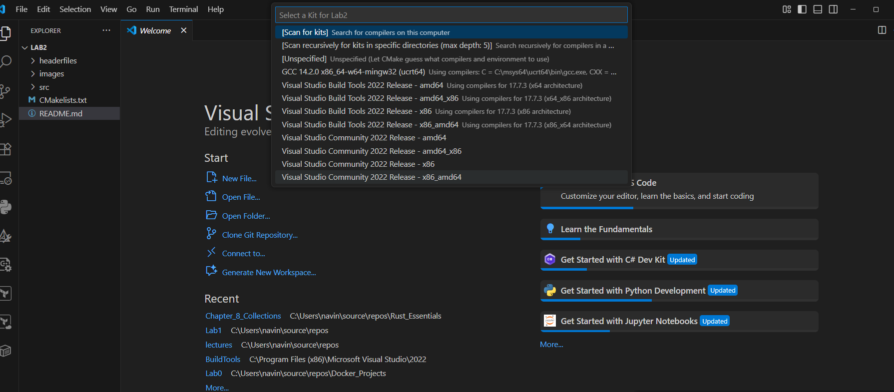
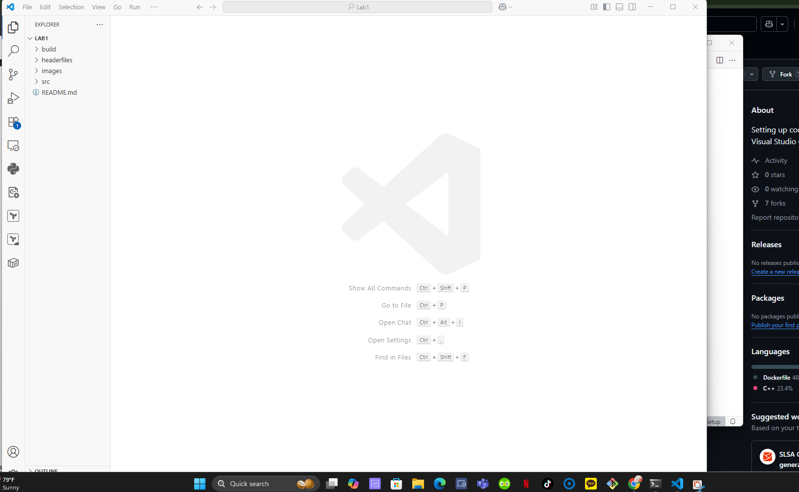
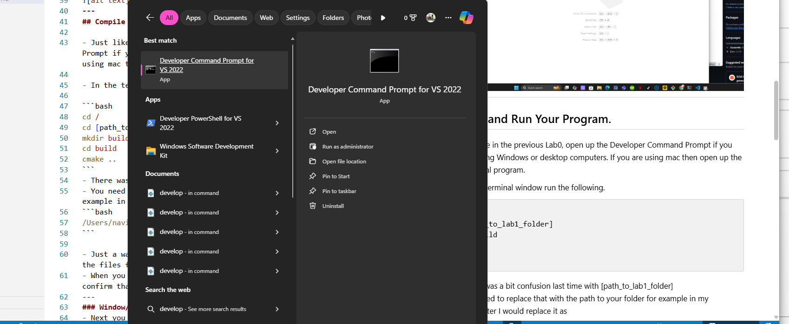
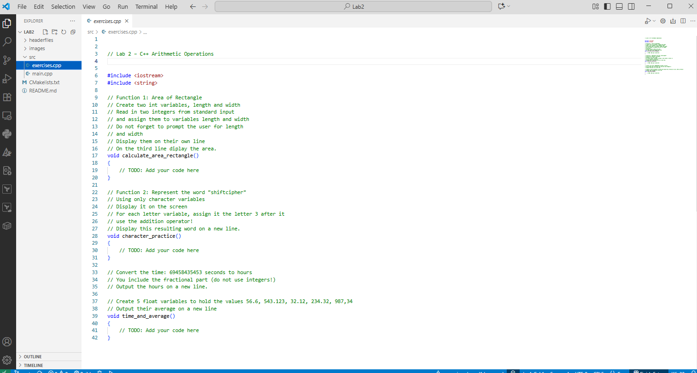

# C++ Programming Lab 2: Practicing Arithmetic Operations


---

## Setting up 


- Right now you should be reading this project in my GitHub page.

- What you will do, is download the this project as a zip.

- Click on the green button and the at bottom there should be download zip. Click it!


- Once you have done that, go to downloads right click and extract the folder


- It is similar process for Macs! The only difference is that instead of right clicking the file, you double click.


- Once that is done, just like the previous Lab, you will open Visual Studio Code
- Once you are in VS Code, you will open click open folder, and open Lab1 folder. 
- If the following window comes up, you should press the ESC button.




- Once you have done that you should see the following


---
## Compile and Run Your Program.

- Just like in the previous Lab0, open up the Developer Command Prompt if you are using Windows or desktop computers. If you are using mac then open up the terminal program.



- In the developer command prompt (terminal if you are on macs) run the following.

```bash
cd /
cd [path_to_lab2_folder]
mkdir build
cd build
cmake ..
```
- There was a bit confusion last time with [path_to_lab2_folder]
- You need to replace that with the path to your folder for example in my computer I would replace it as
```bash
/Users/navin/source/repos/Lab2-master/Lab2-master
```

- Just a warning, you need to be in the folder that contains all the files for Lab2.
- When you download the lab2 zip and extract make sure you confirm that you have all the files in the folder
---
### Window/Desktop Users
- Next you will do the following everytime you make changes to your program and you need to rerun your program. Mac users jump to next section. You will do the same except a different way. This is the most important part of the lab!

```bash
msbuild ALL_BUILD.vcxproj
cd Debug
lab1
cd ..
```
---
### MAC users

Make sure you are in the build directory in the terminal

```bash
cd build
```
- Now everytime you need to run your code do the following.
```bash 
make
./lab1
```
---
## Starting Lab 2

- Go the to src folder and open exercises.cpp file.
- You should see 3 TODOs



- Everytime you want to run your program after you make changes,
Go back to the section that I mentioned above that needs to be repeated everytime you run your program.


## Turning in your Assignment

- You will compress your folder Lab1 to a zip file
- You will then submit the zip file to canvas.